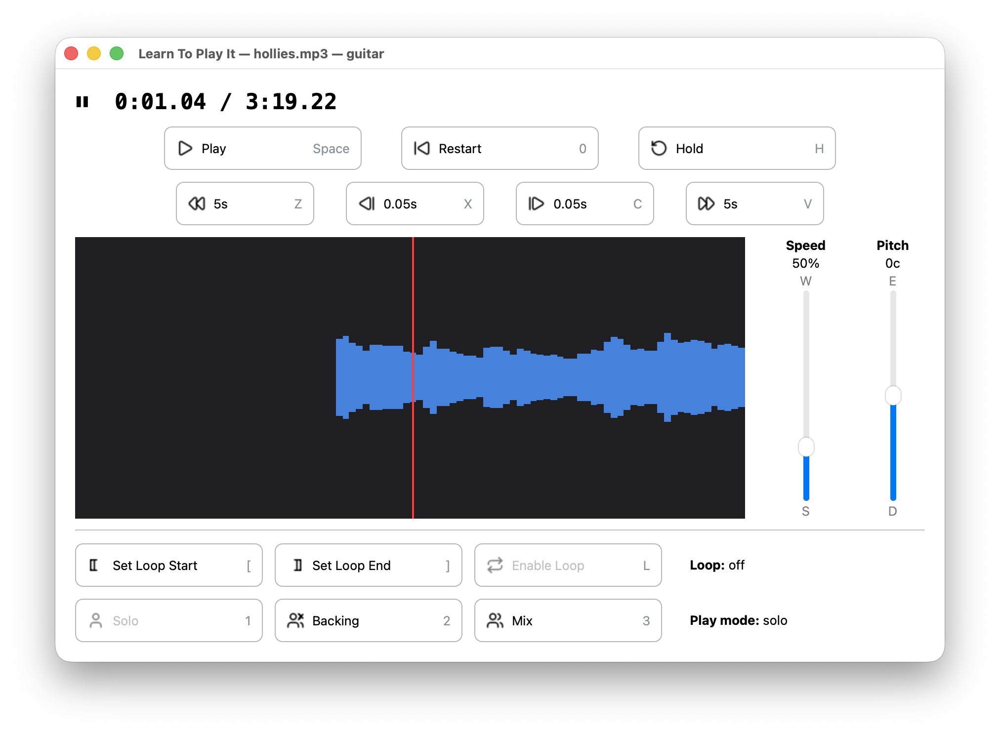

<p align="center">
  
</p>

# Learn To Play It (ltpi)

[](https://github.com/tobycmurray/learn-to-play-it/actions/workflows/ci.yml)

A tool that helps musicians learn parts from recorded songs by:

1. **Separating** a recording into individual instrument stems (vocals, drums, bass, other) using AI source separation
2. **Practicing** an isolated part slowed down, with optional pitch shifting and section looping, progressively speeding up as you learn it
3. **Playing along** with the full mix minus your instrument — like karaoke, but for any part

## Prerequisites

- Python 3.10+
- FFmpeg (`brew install ffmpeg` on macOS, `apt install ffmpeg` on Debian/Ubuntu)

## Installation

```bash
git clone https://github.com/tobycmurray/learn-to-play-it.git
cd learn-to-play-it
python3 -m venv .venv
source .venv/bin/activate
pip install -e .
```

For reproducible installs with pinned dependencies:

```bash
pip install -r requirements.lock && pip install -e . --no-deps
```

This installs the `ltpi` command into your virtualenv. Activate the venv (`source .venv/bin/activate`) before each session.

### GUI

To install with the graphical interface:

```bash
pip install -e ".[gui]"
```

Or with pinned dependencies:

```bash
pip install -r requirements-gui.lock && pip install -e ".[gui]" --no-deps
```

Then launch with:

```bash
ltpi-gui
```

Open an audio file via File > Open. The app will separate stems automatically (with a progress bar), then present a setup dialog to choose your part and mode. The player window provides the same controls as the CLI with clickable buttons, draggable speed/pitch sliders, and a live waveform display.

<p align="center">
  
</p>

The GUI is also available as an alternative frontend for the CLI:

```bash
ltpi practice song.mp3 bass --gui
```

## Usage

### Separate a song into stems (one-time)

```bash
ltpi separate song.mp3
```

Runs AI source separation (Demucs) to produce individual stems. This takes a few minutes on CPU but only needs to be done once per song. Stems are cached in a `stems/` directory.

### Practice a part

```bash
ltpi practice song.mp3 bass
ltpi practice song.mp3 bass --speed 70 --pitch -50
```

Opens an interactive playback session with the bass part isolated, starting at 50% speed (or the speed/pitch you specify). Use keyboard controls to adjust:

| Key     | Action                                |
|---------|---------------------------------------|
| `SPACE` | Play / pause                          |
| `W`/`S` | Speed up / down ±10% (range: 20%–150%) |
| `E`/`D` | Pitch up / down ±10 cents (up to ±1 octave) |
| `Z`/`V` | Seek back / forward 5 seconds        |
| `X`/`C` | Nudge back / forward 0.05 seconds    |
| `[`/`]` | Set loop start / end                  |
| `L`     | Toggle loop on/off                    |
| `H`     | Hold — freeze last 200ms and loop it |
| `1`/`2`/`3` | Mode: solo / backing / mix        |
| `0`     | Restart (or loop start if looping)    |
| `Q`     | Quit                                  |


These keys follow a visual layout, shown below:
```
  +-----+-----+-----+-----+-----+-----+-----+-----+-----+-----+-----+-----+
  |  1  |  2  |  3  |     |     |     |     |     |     |     |     |     |
  |     |     |     |     |     |     |     |     |     |     |     |     |
  |solo |back-| mix |     |     |     |     |     |     |     |     |     |
  |     | ing |     |     |     |     |     |     |     |     |     |     |
  +-----+-----+-----+-----+-----+-----+-----+-----+-----+-----+-----+-----+
  |  Q  |  W  |  E  |     |     |     |     |     |     |     |  [  |  ]  |
  |     |     |     |     |     |     |     |     |     |     |     |     |
  |quit |speed|pitch|     |     |     |     |     |     |     |loop |loop |
  |     | up  | up  |     |     |     |     |     |     |     |start| end |
  +-----+-----+-----+-----+-----+-----+-----+-----+-----+-----+-----+-----+
  |     |  S  |  D  |     |     |  H  |     |     |  L  |     |     |     |
  |     |     |     |     |     |     |     |     |loop |     |     |     |
  |     |speed|pitch|     |     |hold |     |     |on / |     |     |     |
  |     |down |down |     |     |note |     |     |off  |     |     |     |
  +-----+-----+-----+-----+-----+-----+-----+-----+-----+-----+-----+-----+
  |  Z  |  X  |  C  |  V  |     |     |     |     |     |     |     |     |
  |skip |nudge|nudge|skip |     |     |     |     |     |     |     |     |
  |back |back | fwd | fwd |     |     |     |     |     |     |     |     |
  | <<  |  <  |  >  | >>  |     |     |     |     |     |     |     |     |
  +-----+-----+-----+-----+-----+-----+-----+-----+-----+-----+-----+-----+

        SPACE = play/pause    0 = restart    1/2/3 = solo/backing/mix

```

A waveform is rendered when playback is paused, allowing precise control of loop start and end points:
```
Playing: guitar (solo)
Controls: SPACE=play/pause  W/S=speed  E/D=pitch  Z/X/C/V=seek  H=hold
          [/]=loop start/end  L=loop  1/2/3=solo/backing/mix  0=restart  Q=quit

  ⏸ 0:13.31 / 3:19.22  |  speed: 50%  |  pitch: 0c  |  loop: OFF 0:11.70-0:14.41  |  mode: solo  |  part: guitar                               
                                                                                                                                               
                                                                                                                                ▆              
                                                                                                                                █              
                                                                                                 ▇        ▇       ▃        ▅    █▁             
                                                     ▁            ▁                              █        █       █▁       █   ▅██▄▁     ▃  ▁  
     ▁   ▁ ▁ ▁▂▂ ▁▁   ▁▁▁ ▅▁▁      ▁   ▆▃▁           █▁           █▂       ▂▂                    █       ▇█       ██       █▄  █████▁   ▂█▅▁█  
  ▄▃▆█▇▇▆█▇█▅███▇██▆▅▃███▇███▅▃▅▅▃▁█▅▅▄███▇▅▅▂▃▂▄▆▃▃▇██▅▃▃▃▃▁▂▅▂▁▁██▇▄▄▃▁▁▁██▇▆▆       ▁ ▁      ▄█▇      ██▆▁     ██▃      ██▆▂██████▅▅▃█████  
  ██████████████████████████████████████████████████████████████████████████████▆▆▇▇▇▇▇█▇█▇▆▅▄▂▂███▇▅▃▃▂▁████▅▄▃▃▂███▇▆▄▃▂▂██████████████████  
                                      [                                ↑                     ]                                                 
```

**Modes** (cycled with `M`):
- **solo** — hear only the selected part
- **mute** — hear everything *except* the selected part (play-along)
- **mix** — hear the full original mix

Pitch is displayed in semitones and cents when the shift is large enough (e.g. `+3st+20c`), useful for transposing parts into a comfortable range.

### Play along

```bash
ltpi play-along song.mp3 bass
ltpi play-along song.mp3 bass --speed 80
```

Shortcut that opens the same interactive session but starts in **mute** mode at **100% speed** — everything except your part, at full tempo. Use `--speed` and `--pitch` to override the defaults.

### List available parts

```bash
ltpi parts song.mp3
```

Shows which stems are available after separation.

### Delete cached stems

```bash
ltpi clean song.mp3
```

Removes the cached stems for a song, freeing disk space.

### Audio device selection

By default, ltpi uses your system's default audio output. To use a different device:

```bash
# List available output devices
ltpi devices

# Select by index or name (substring match)
ltpi practice song.mp3 guitar --device 5
ltpi practice song.mp3 guitar --device "MacBook"
```

The `--device` option is available on both `practice` and `play-along`.

### Global options

```bash
ltpi --stems-dir /path/to/cache practice song.mp3 guitar
```

Use `--stems-dir` to store stems in a custom location (default: `./stems`).

## How it works

- **Source separation**: [Demucs](https://github.com/adefossez/demucs) (Meta Research) splits audio into six stems: vocals, drums, bass, guitar, piano, and other
- **Time-stretching & pitch-shifting**: [Rubber Band](https://breakfastquay.com/rubberband/) (via [pylibrb](https://github.com/pawel-glomski/pylibrb)) processes audio in real-time — speed and pitch changes are instant with no playback pause
- **Playback**: [sounddevice](https://python-sounddevice.readthedocs.io/) provides low-latency audio output

## Stem cache

Separated stems are cached under `stems/<sha256-hash>/` based on the audio file's contents. This means renaming or moving the file won't trigger re-separation, and identical copies of the same file share stems. Re-running `separate` on an already-processed song is a no-op.

## Getting audio from YouTube

You can use [yt-dlp](https://github.com/yt-dlp/yt-dlp) to download audio from YouTube for use with ltpi:

```bash
# Install yt-dlp
brew install yt-dlp        # macOS
pip install yt-dlp         # or via pip

# Download audio as MP3
yt-dlp -x --audio-format mp3 -o "song.%(ext)s" "https://youtube.com/watch?v=..."

# Then separate and practice
ltpi separate song.mp3
ltpi practice song.mp3 guitar
```

**Legal note**: Downloading audio from YouTube may violate YouTube's Terms of Service and could raise copyright concerns depending on your jurisdiction. Users are responsible for ensuring their use complies with applicable laws and terms. This tool is intended for personal practice and educational use.

## Possible future directions

- MIDI / guitar tab transcription from isolated parts
- Standalone macOS app bundle
